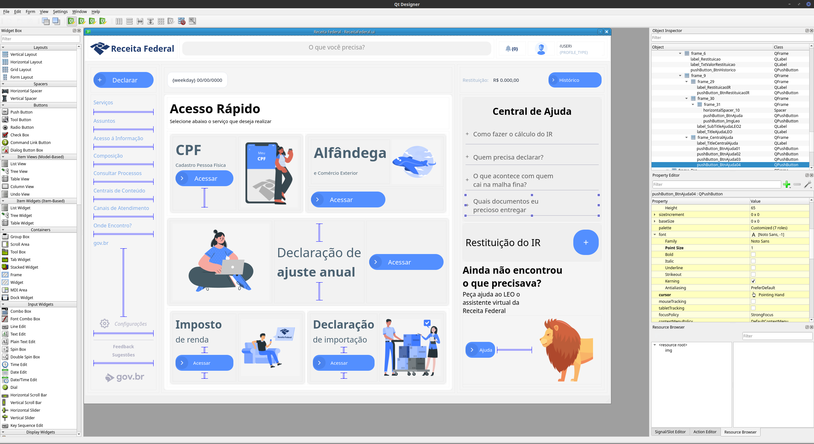
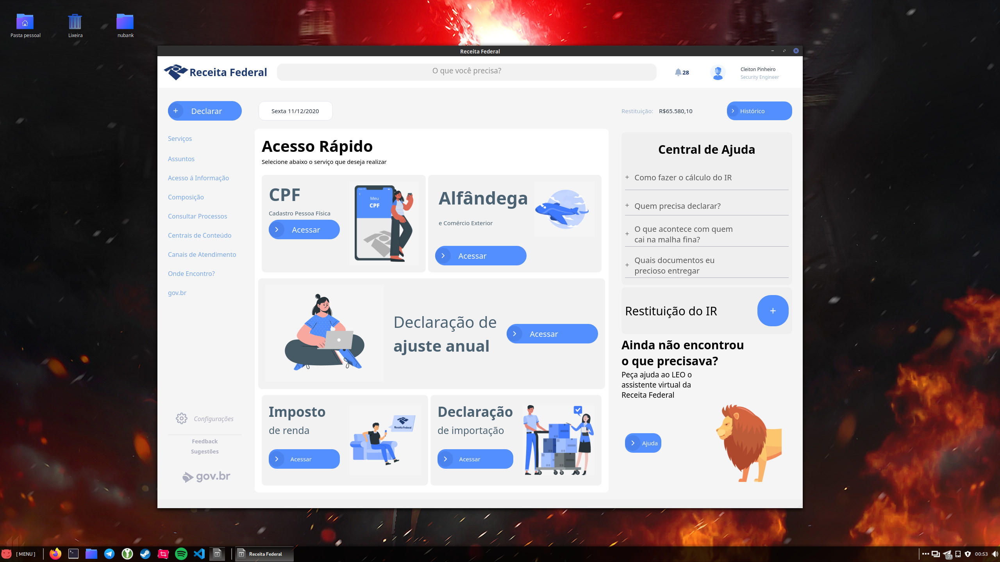
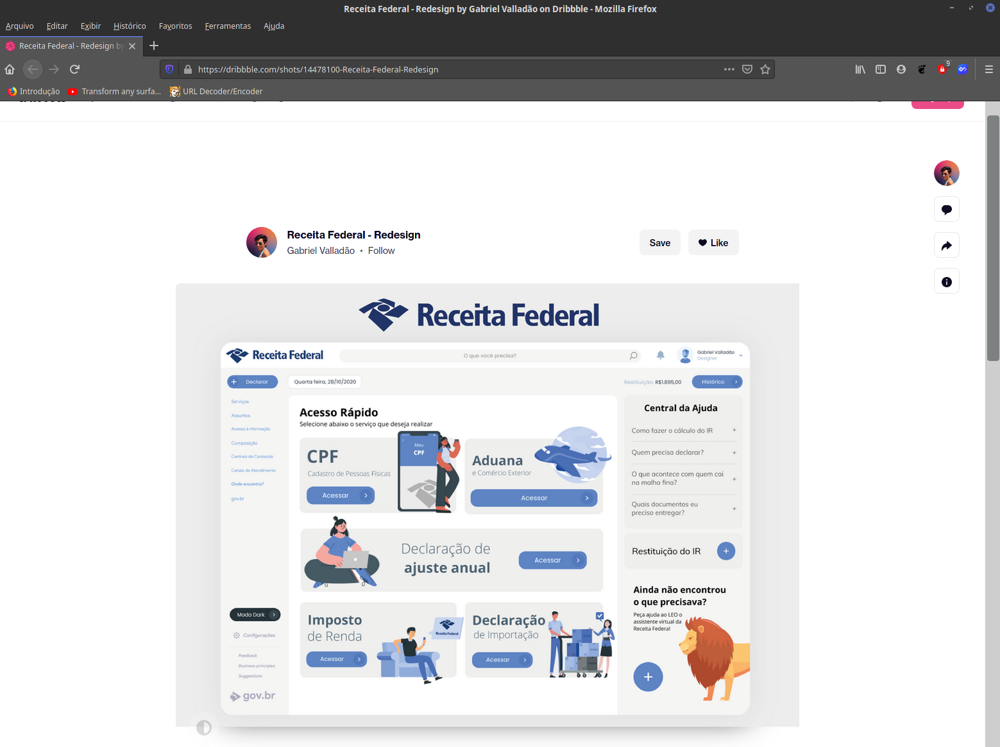

# Dash Receita Federal with PyQt5 
[](https://www.python.org/)
[]()
[]()

--
This is the study of an interface with PyQt5 /
Python - Receita Federal - Modern Gui [Qt Designer, PyQt5].

The Federal Revenue is an agency that supervises and collects taxes that are collected by the Brazilian federal government. With the computerization of services, it is necessary to think about Experience and Interface Design to deliver the best to the taxpayer citizen. This repository had as a reference the redesign( modern ) project prepared by Gabriel Valladão.

## Using Qt Designer
Qt Designer is the Qt tool for designing and building graphical user interfaces (GUIs) with Qt Widgets. You can compose and customize your windows or dialogs in a what-you-see-is-what-you-get (WYSIWYG) manner, and test them using different styles and resolutions.


Qt Designer: https://doc.qt.io/qt-5/qtdesigner-manual.html


## Required packages
```bash
$ pip install -r requirements.txt
```
## Use
```bash
$ python main.py
```

## Files
```bash
.
├── assets
│   ├── files.py
│   ├── files.qrc
│   ├── img
│   │   ├── *.png
│   ├── __init__.py
│   ├── prints
│   │   ├── form.png
│   │   ├── qt.png
│   │   └── ref.png
│   └── svg
│       ├── Receita Federal - Concept Design.svg
│       └── Receita Federal - Concept Design.zip
├── data.json
├── main.py
├── README.md
├── ReceitaFederal.ui
├── requirements.txt
└── ui_ReceitaFederal.py

6 directories, 198 files


3 directories, 14 files
```
## My reference

Ref: https://doc.qt.io/qt-5/qtdesigner-manual.html

## Execute Click Buttons
This block of code is responsible for setting and executing the click_button function.
```python
self.ui_main.pushButton_BtnDeclarar.clicked.connect(lambda x:self.click_button('DECLARAR'))
self.ui_main.pushButton_BtnServico.clicked.connect(lambda x:self.click_button('SERVIÇO'))
self.ui_main.pushButton_BtnAssuntos.clicked.connect(lambda x:self.click_button('ASSUNTOS'))
self.ui_main.pushButton_BtnAcessoInfo.clicked.connect(lambda x:self.click_button('ACESSO INFO'))
self.ui_main.pushButton_BtnComposicao.clicked.connect(lambda x:self.click_button('COMPOSIÇÃO'))
self.ui_main.pushButton_BtnConsultaProcessos.clicked.connect(lambda x:self.click_button('CONSULTA PROCESSOS'))
self.ui_main.pushButton_BtnCentraisConteudo.clicked.connect(lambda x:self.click_button('CENTRAIS DE CONTEÚDO'))
self.ui_main.pushButton_BtnCanaisAtendimento.clicked.connect(lambda x:self.click_button('CANAIS DE ATENDIMENTO'))
self.ui_main.pushButton_BtnOndeEncontro.clicked.connect(lambda x:self.click_button('ONDE ENCONTRO'))
self.ui_main.pushButton_BtnGovbr.clicked.connect(lambda x:self.click_button('GOV.BR'))

self.ui_main.pushButton_BtnConfiguracao.clicked.connect(lambda x:self.click_button('CONFIGURAÇÃO'))
self.ui_main.pushButton_BtnFeedback.clicked.connect(lambda x:self.click_button('FEEDBACK'))
self.ui_main.pushButton_BtnSugestao.clicked.connect(lambda x:self.click_button('SUGESTÃO'))

self.ui_main.pushButton_BtnCPF.clicked.connect(lambda x:self.click_button('CPF'))
self.ui_main.pushButton_BtnAlfandega.clicked.connect(lambda x:self.click_button('ALFANDEGA'))
self.ui_main.pushButton_BtnAjusteAnual.clicked.connect(lambda x:self.click_button('AJUSTE ANUAL'))
self.ui_main.pushButton_BtnImpostoRenda.clicked.connect(lambda x:self.click_button('DECLARAR IMPOSTO'))
self.ui_main.pushButton_BtnDeclaracaoImport.clicked.connect(lambda x:self.click_button('DECLAÇÃO DE IMPORTAÇÃO'))

self.ui_main.pushButton_BtnHistorico.clicked.connect(lambda x:self.click_button('HISTORICO'))

self.ui_main.pushButton_BtnAjuda01.clicked.connect(lambda x:self.click_button('AJUDA 01'))
self.ui_main.pushButton_BtnAjuda02.clicked.connect(lambda x:self.click_button('AJUDA 02'))
self.ui_main.pushButton_BtnAjuda03.clicked.connect(lambda x:self.click_button('AJUDA 03'))
self.ui_main.pushButton_BtnAjuda04.clicked.connect(lambda x:self.click_button('AJUDA 04'))
        
self.ui_main.pushButton_BtnRestituicaoIR.clicked.connect(lambda x:self.click_button('RESTITUIÇÃO'))
self.ui_main.pushButton_BtnAjuda.clicked.connect(lambda x:self.click_button('AJUDA'))
```

## Function Buttons
```python
# Clicked buttons
def click_button(self,value):
    print('CLICKED',value)
```

# My study reference
- https://www.semicolonworld.com/question/53672/using-lambda-expression-to-connect-slots-in-pyqt
- https://gis.stackexchange.com/questions/293285/problem-converting-qrc-file-into-py-one-by-pyqt5
- https://dribbble.com/shots/14478100-Receita-Federal-Redesign
- https://www.figma.com/file/TmrX2iuJ2F2w0wWzUwPKu3/Receita-Federal---Concept-Design

